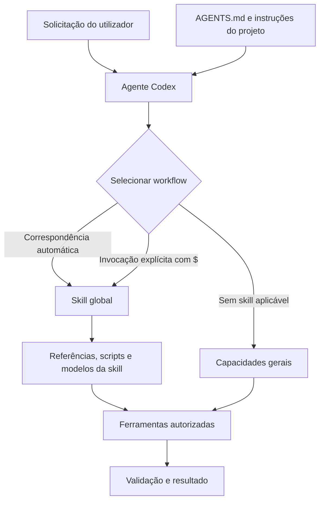

# Arquitetura e inventário de agentes e skills do Codex

**Última validação:** 30 de setembro de 2026  
**Escopo:** ambiente Codex do utilizador `amaeda`  
**Objetivo:** registrar a arquitetura, a localização, a origem e o histórico das instalações de agentes e skills usadas nos projetos.

> Este documento não contém credenciais, tokens nem configurações sensíveis. Deve ser atualizado sempre que uma skill ou agente for instalado, atualizado, migrado ou removido.

## 1. Conceitos

### Agente

O agente é o processo de IA que interpreta a solicitação, lê as instruções disponíveis, seleciona ferramentas e executa o trabalho autorizado.

### Skill

Uma skill é um pacote de instruções reutilizáveis. Cada skill possui um arquivo `SKILL.md` e pode conter scripts, referências e modelos auxiliares.

Uma skill:

- orienta como executar uma categoria de trabalho;
- pode ser selecionada automaticamente pela descrição da solicitação;
- pode ser invocada explicitamente com `$nome-da-skill`;
- não é um plugin MuleSoft, biblioteca Java ou serviço em execução;
- não substitui testes, validações automatizadas ou revisão humana.

### `AGENTS.md`

O `AGENTS.md` define regras gerais do repositório ou do ambiente. Ele é diferente de uma skill: suas regras se aplicam ao trabalho no escopo correspondente, enquanto uma skill descreve um workflow especializado.

## 2. Arquitetura do ambiente



### Ordem conceitual

1. O utilizador descreve o objetivo.
2. O Codex aplica as regras gerais e as instruções do projeto.
3. O agente compara a solicitação com as descrições das skills disponíveis.
4. A skill aplicável fornece o procedimento especializado.
5. O agente usa ferramentas somente dentro das permissões concedidas.
6. O resultado é validado e apresentado ao utilizador.

## 3. Localização e escopo

### Skills globais

```text
/Users/amaeda/.codex/skills/<nome-da-skill>/SKILL.md
```

As skills globais ficam disponíveis para todos os projetos do mesmo utilizador neste ambiente Codex.

### Skills locais do projeto

```text
<projeto>/.agents/skills/<nome-da-skill>/SKILL.md
```

As skills locais aplicam-se ao projeto e podem ser versionadas para compartilhar o mesmo workflow com a equipe.

### Decisão atual

As skills genéricas e MuleSoft estão instaladas globalmente. A antiga pasta local `.agents/skills` foi removida depois da validação da migração. Uma futura skill com regras exclusivas da Garrafeira deverá ser instalada localmente e versionada no projeto.

## 4. Inventário global validado

| Skill | Origem | Finalidade principal | Observação |
|---|---|---|---|
| `build-mule-integration` | `mulesoft/mulesoft-dx` | Criar ou alterar flows, subflows, componentes e DataWeave Mule | Workflow obrigatório antes de alterações em integrações Mule |
| `manage-global-configurations` | `mulesoft/mulesoft-dx` | Gerenciar configurações globais Mule | Abrange HTTP Config, TLS, Object Store, propriedades e error handlers globais |
| `secure-mule-app` | `mulesoft/mulesoft-dx` | Configurar Secure Properties | Aplicável à proteção de credenciais e propriedades sensíveis |
| `generate-bat-tests` | `mulesoft/mulesoft-dx` | Gerar BAT e testes black-box de APIs Mule | Não substitui MUnit |
| `generate-connectivity-knowledge` | `mulesoft/mulesoft-dx` | Criar conhecimento de conectividade para APIs SaaS | Usar quando não existir conector Mule dedicado |
| `run-system-diagnostics` | `mulesoft/mulesoft-dx` | Diagnosticar requisitos do Anypoint Code Builder | Não é um analisador geral de logs do Mule Runtime |
| `code-review` | `microsoft/vscode` | Revisar diffs, branches e regressões | Procura defeitos, escopo indevido e lacunas de teste |
| `find-skills` | `vercel-labs/skills` | Descobrir e avaliar novas skills | Verifica uso, reputação da origem e sinais de qualidade |
| `grill-me` | `mattpocock/skills` | Iniciar entrevista crítica sobre plano ou arquitetura | Invocada explicitamente; delega para `grilling` |
| `grilling` | `mattpocock/skills` | Executar entrevista crítica, uma decisão por vez | Dependência funcional de `grill-me` |
| `playwright` | Instalação anterior do ambiente | Automatizar navegador para testes e inspeções | Já existia antes das instalações registradas abaixo |

## 5. Histórico de instalações

| Data | Operação | Skills | Destino | Resultado |
|---|---|---|---|---|
| 30/09/2026 | Instalação inicial no projeto | `build-mule-integration`, `run-system-diagnostics`, `secure-mule-app`, `manage-global-configurations`, `generate-bat-tests`, `generate-connectivity-knowledge`, `code-review` | `.agents/skills` | Concluída e validada |
| 30/09/2026 | Migração para instalação global | As sete skills acima e `find-skills` | `/Users/amaeda/.codex/skills` | Concluída e validada |
| 30/09/2026 | Limpeza da instalação local | Cópias em `.agents/skills` e `skills-lock.json` local | Projeto | Removidas após validação global |
| 30/09/2026 | Instalação global | `grill-me` e dependência `grilling` | `/Users/amaeda/.codex/skills` | Concluída e validada |
| 30/09/2026 | Limpeza de links locais obsoletos | Links `.claude/skills/find-skills` e `.qwen/skills/find-skills` | Projeto | Removidos porque apontavam para a antiga `.agents/skills/find-skills` |

## 6. Como invocar

### Seleção automática

O agente pode selecionar uma skill quando a descrição da solicitação corresponde ao seu escopo.

```text
Revise a branch atual comparando com develop.
```

### Seleção explícita

Use `$` seguido do nome:

```text
$code-review revise esta branch contra develop
```

```text
$build-mule-integration ajuste o flow de terceiros
```

```text
$grill-me questione a arquitetura proposta antes da implementação
```

O menu aberto com `/` apresenta comandos internos do Codex e não é o inventário completo das skills instaladas.

## 7. Regras de instalação e manutenção

Antes de instalar uma nova skill:

1. verificar se ela resolve uma necessidade real e recorrente;
2. conferir origem, número de instalações, atividade do repositório e auditorias disponíveis;
3. ler o `SKILL.md` e identificar scripts, comandos e dependências;
4. preferir instalação global para workflows genéricos;
5. preferir instalação local para regras exclusivas do projeto;
6. evitar skills sobrepostas, pois suas descrições também ocupam contexto;
7. validar a existência do `SKILL.md` depois da instalação;
8. atualizar este documento;
9. não fazer commit ou push sem autorização explícita.

## 8. Registro para próximas alterações

Cada instalação futura deve acrescentar uma linha ao histórico contendo:

```text
Data | Operação | Skill e origem | Destino | Motivo | Resultado
```

Em caso de atualização, registrar também a referência anterior e a nova referência quando essa informação estiver disponível. Em caso de remoção, registrar o motivo e confirmar que nenhuma skill dependente ficou incompleta.

## 9. Limitações conhecidas

- Instalar uma skill não garante que ela aparecerá no menu `/`.
- Uma nova conversa ou reinicialização do Codex pode ser necessária para atualizar a descoberta visual.
- Skills são instruções interpretadas pelo agente; controles críticos devem existir também em testes e pipelines.
- Muitas skills aumentam o contexto inicial e podem criar regras conflitantes.
- Números de instalações e sinais de reputação mudam e devem ser verificados novamente antes de novas decisões.
